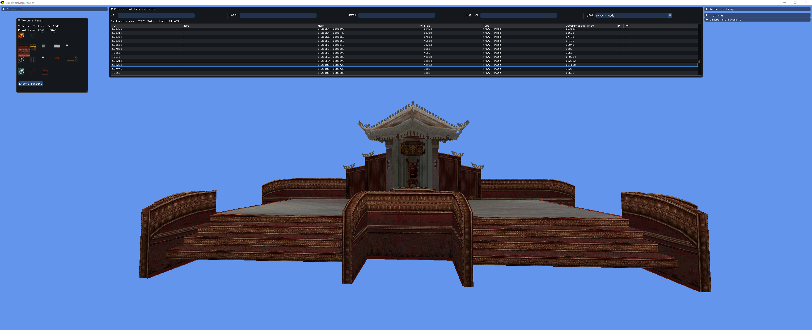

Guild Wars Map Browser
=====================

Browse the Guild Wars .dat file. Included features:
- Searching and filtering the internal files in the dat.
- Rendering 3D terrains for all maps.
- Fly around in and explore the maps in first person.
- Hex editor viewer of files.
- Playback of audio files.
- Extract 3D models and textures.
- And more
 
 Here is an preview of Monastery Overlook as seen rendered in GuildWarsMapBrowser:

And here is an example of rendering a model:

## Building
To build just clone the repository and open the .Sln in Visual Studio. Build in x86 mode (release or debug). Cannot build 64-bit.

## Contributing
See *CONTRIBUTING.MD*

## Credits:
Decompressing the .dat file uses the source code from:
 - [GWDatBrowser]https://github.com/kytulendu/GWDatBrowser
     - Specifically I use: AtexAsm.h/cpp, AtexReader.h/cpp, GWUnpacker.h/cpp, xentax.h/cpp
