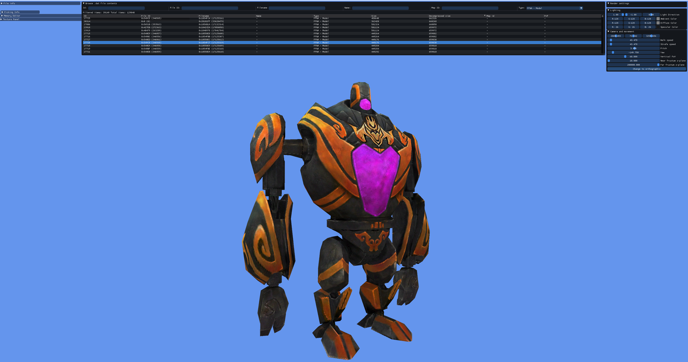
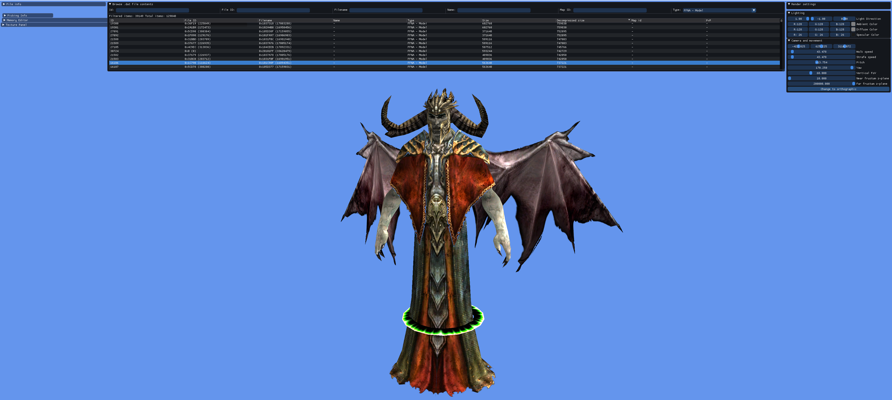
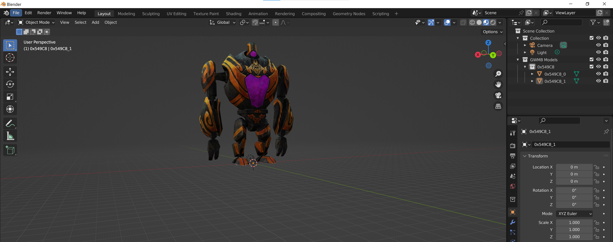
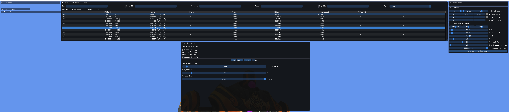

# Guild Wars Map Browser
Browse the Guild Wars .dat file. Included features:
- Searching and filtering the internal files in the dat.
- Rendering 3D terrains for all maps.
- Fly around in and explore the maps in first person.
- Export and import full maps and models to Blender.
- Hex editor viewer of files.
- Playback of audio files.
- Extract 3D models and textures.
- And more

## How to use
- You might need vc_redist_x86 (Microsoft Visual c++ Redistributable) that you can get [here](https://learn.microsoft.com/en-us/cpp/windows/latest-supported-vc-redist?view=msvc-170) or [direct download link](https://aka.ms/vs/17/release/vc_redist.x86.exe).
- Download GuildWarsMapBrowser.exe from [releases](https://github.com/Jonathan-Greve/GuildWarsMapBrowser/releases) and run it.
- To import into Blender see the guide in the release notes or check [this reddit post](https://www.reddit.com/r/GuildWars/comments/17wnlj3/guild_wars_map_browser_v50_exporting_to_blender)

## Preview
 
 Here is an preview of Monastery Overlook as seen rendered in GuildWarsMapBrowser and pre-searing Ascalon City

And here is an example of rendering some models:

And imported Pre-searing Ascalon City in Blender:

Golem imported in Blender

Viewing textures in Guild Wars Map Browser:

Audio playback and controls

## Building
To build just clone the repository and open the .Sln in Visual Studio. Build in x86 mode (release or debug). Cannot build 64-bit.

## Contributing
See *CONTRIBUTING.MD*

## Credits:
Decompressing the .dat file uses the source code from:
 - [GWDatBrowser](https://github.com/kytulendu/GWDatBrowser)
     - Specifically I use: AtexAsm.h/cpp, AtexReader.h/cpp, GWUnpacker.h/cpp, xentax.h/cpp
 - The Guild Wars community for being supportive and showing interest in the project.
