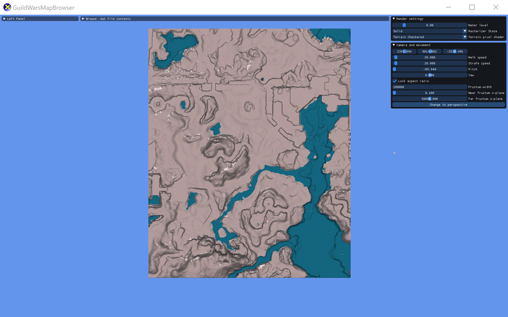

Guild Wars Map Browser
=====================

Browse the Guild Wars .dat file. Included features:
- Searching and filtering the internal files in the dat.
- Rendering 3D terrains for all maps.
- Fly around in and explore the maps in first person.
 
 Here is an preview of Pre-searing near Old Ascalon City and the surrounding terrain:

Credits:
Decompressing the .dat file uses the source code from:
 - [GWDatBrowser]https://github.com/kytulendu/GWDatBrowser
     - Specifically I use: AtexAsm.h/cpp, AtexReader.h/cpp, GWUnpacker.h/cpp, xentax.h/cpp
